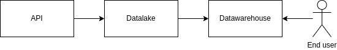

# Context
- The goal of this project is to test your Python skills by writing a short local data Pipeline
- The code that you will write can go directly into the `src/main.py` file, you can also split your code if you prefer
- All the resources needed to create the pipeline are defined in the folders of this project

The pipeline will follow these steps:

- Extracting the data from an api and storing it to a datalake
  - The API will run localy, you can start it by following the section `Start the project` bellow
  - The folder `datalake` in this project will act as the datalake, you will need to store the data extracted from the API into one or several CSV files into this folder
- Reading the data stored from the datalake and storing it into a table in a datawarehouse
  - The datawarehouse will be a SQLite table as the sqlite library is a python builtin

# Evaluation criterias
- The code should run without error and produce the expected output described in the Context section
- The code should be easy to read, maintain and follow Python best practices
- You can write the possible improvements that you would add to your code if you had an unlimited amount of time

# Start the project
- Open a terminal and place yourself at the root of this folder then run the following commands

```bash
# Create a python virtualenv and install the dependancies
python -m venv venv
source venv/bin/activate
pip install -r requirements.txt

# Start the API application
uvicorn scripts.product_api:app --reload --host=127.0.0.1 --port=8000
```

# API documentation

- The api contains only one endpoint: `myendpoint`
- You can curl the endpoint after starting the API application to do some tests before writing your python code: `curl -X 'GET' 'http://127.0.0.1:8000/myendpoint' | python -m json.tool`
- The API page the responses, starting at 1
- To know if there's still pages left, the API response contains a field `has_more` that is set to `yes`


here is an example of an API response:
```json
{
    "products": [
        {
            "id": 3,
            "name": "product_c",
            "price": 12
        },
        {
            "id": 4,
            "name": "product_d",
            "price": 15
        }
    ],
    "has_more": "yes"
}
```

# Table documentation

- The table name will be `dim_product`  

| field_name | type    |
| -----------|---------|
| name       | STRING  |
| id         | INTEGER |
| price      | INTEGER |